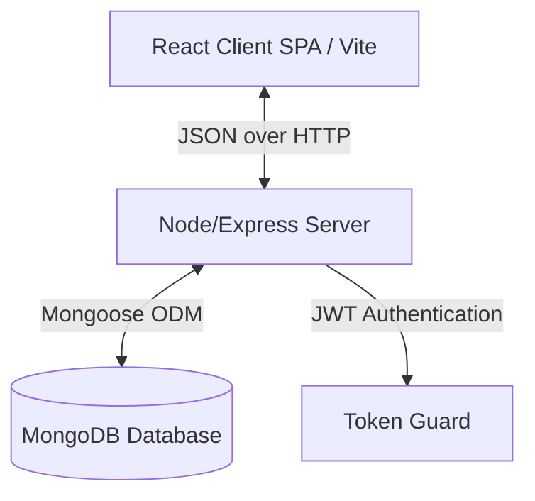

# Technical Requirements Document (TRD)

## Project: Royal - Premium Clothing Brand & E-Commerce Marketplace
**Version:** 1.0.0  
**Author:** Antigravity (Advanced Agentic Coding Partner)  
**Status:** Draft for User Review  

---

## 1. System Architecture
The application follows the decoupled Client-Server architecture utilizing the **MERN** stack:
- **Frontend:** React.js SPAs (Single Page Application) initialized via **Vite** for optimized building, styling in **Vanilla CSS** for precise artistic control, and **React Router DOM** for navigation.
- **Backend:** Node.js with **Express.js** to handle REST API endpoints, routing, authentication, and database transactions.
- **Database:** **MongoDB** (using **Mongoose** ODM) for high-performance schema definition and validation.



---

## 2. Technology Stack & Packages

### 2.1. Backend (`back`)
- **Runtime:** Node.js (v18+)
- **Framework:** Express.js
- **Database Connection:** Mongoose ODM
- **Security & Utilities:**
  - `bcryptjs` - Password hashing.
  - `jsonwebtoken` (JWT) - Secure stateless user session tokens.
  - `cors` - Cross-Origin Resource Sharing.
  - `dotenv` - Environmental configurations.
  - `morgan` - HTTP request logger.

### 2.2. Frontend (`front`)
- **Build Tool:** Vite (React template)
- **State Management:** React Context API (Auth, Cart, and Products modules).
- **Routing:** React Router DOM (v6+)
- **Icons:** `lucide-react` for high-quality, modern, minimalist icons.
- **Styling:** Vanilla CSS (CSS Variables, Flexbox, CSS Grid, Glassmorphic effects, CSS Transitions/Animations).

---

## 3. Database Schema Design (MongoDB / Mongoose)

### 3.1. User Schema (`users`)
```json
{
  "_id": "ObjectId",
  "name": "String (required)",
  "email": "String (required, unique)",
  "password": "String (required, hashed)",
  "isAdmin": "Boolean (default: false)",
  "createdAt": "Date",
  "updatedAt": "Date"
}
```

### 3.2. Product Schema (`products`)
```json
{
  "_id": "ObjectId",
  "name": "String (required)",
  "description": "String (required)",
  "price": "Number (required, default: 0.00)",
  "category": "String (required)",
  "images": ["String (URLs of product images)"],
  "sizes": ["String (e.g. S, M, L, XL)"],
  "colors": ["String (e.g. Black, Gold, Navy)"],
  "stock": "Number (required, default: 0)",
  "reviews": [
    {
      "user": "ObjectId (ref: User)",
      "name": "String (required)",
      "rating": "Number (required)",
      "comment": "String (required)",
      "createdAt": "Date"
    }
  ],
  "rating": "Number (default: 0)",
  "numReviews": "Number (default: 0)",
  "createdAt": "Date"
}
```

### 3.3. Order Schema (`orders`)
```json
{
  "_id": "ObjectId",
  "user": "ObjectId (ref: User, required)",
  "orderItems": [
    {
      "name": "String (required)",
      "qty": "Number (required)",
      "image": "String (required)",
      "price": "Number (required)",
      "size": "String (required)",
      "color": "String (required)",
      "product": "ObjectId (ref: Product, required)"
    }
  ],
  "shippingAddress": {
    "address": "String (required)",
    "city": "String (required)",
    "postalCode": "String (required)",
    "country": "String (required)"
  },
  "paymentMethod": "String (required, default: 'Credit Card')",
  "paymentResult": {
    "id": "String",
    "status": "String",
    "email_address": "String"
  },
  "totalPrice": "Number (required, default: 0.0)",
  "isPaid": "Boolean (default: false)",
  "paidAt": "Date",
  "isDelivered": "Boolean (default: false)",
  "deliveredAt": "Date",
  "orderStatus": "String (default: 'Processing' - options: 'Processing', 'Shipped', 'Delivered')",
  "createdAt": "Date"
}
```

---

## 4. API Endpoints Specification

### 4.1. Authentication & Users (`/api/users`)
- `POST /register` - Register a new user. Returns JWT & user profile.
- `POST /login` - Log in existing user. Returns JWT & user profile.
- `GET /profile` - Retrieve logged-in user profile (Requires JWT).
- `PUT /profile` - Update logged-in user profile (Requires JWT).

### 4.2. Products (`/api/products`)
- `GET /` - Fetch all products (supports query parameters for filter/search).
- `GET /:id` - Fetch single product details.
- `POST /` - Create a product (Requires Admin JWT).
- `PUT /:id` - Update a product (Requires Admin JWT).
- `DELETE /:id` - Delete a product (Requires Admin JWT).
- `POST /:id/reviews` - Add a review to a product (Requires JWT).

### 4.3. Orders (`/api/orders`)
- `POST /` - Create a new order (Requires JWT).
- `GET /myorders` - Fetch orders of logged-in customer (Requires JWT).
- `GET /:id` - Fetch details of a specific order (Requires JWT / Admin JWT).
- `PUT /:id/pay` - Mark order as paid (Requires JWT).
- `GET /` - Fetch all orders (Requires Admin JWT).
- `PUT /:id/deliver` - Mark order as shipped/delivered (Requires Admin JWT).

---

## 5. Directory Structures

### 5.1. Backend Layout (`/back`)
```
/back
├── config
│   └── db.js            # Mongoose MongoDB connection config
├── controllers
│   ├── orderController.js
│   ├── productController.js
│   └── userController.js
├── middleware
│   ├── authMiddleware.js # JWT payload decryption & route shielding
│   └── errorMiddleware.js# Catch-all Express global error handler
├── models
│   ├── orderModel.js
│   ├── productModel.js
│   └── userModel.js
├── routes
│   ├── orderRoutes.js
│   ├── productRoutes.js
│   └── userRoutes.js
├── utils
│   └── generateToken.js  # JWT signing helper
├── .env                  # Configuration variables (PORT, MONGO_URI, JWT_SECRET)
├── package.json
└── server.js             # Express app bootstrap & listener
```

### 5.2. Frontend Layout (`/front`)
```
/front
├── public/               # Static assets
├── src
│   ├── assets/           # Curated collection photos/branding
│   ├── components/
│   │   ├── AdminRoute.jsx     # Protects admin routes
│   │   ├── BackToTop.jsx      # Scroll utility
│   │   ├── Footer.jsx
│   │   ├── GlassCard.jsx      # Reusable glassmorphic layout card
│   │   ├── Header.jsx         # Elegant navbar
│   │   ├── InteractiveCard.jsx# Payment wizard virtual credit card
│   │   ├── ProductCard.jsx    # Premium catalog card with micro-interactions
│   │   └── ProtectedRoute.jsx # Protects generic customer routes
│   ├── context/
│   │   ├── AuthContext.jsx    # Authentication global state
│   │   ├── CartContext.jsx    # Shopping Cart global state
│   │   └── ProductContext.jsx # Products listings state
│   ├── pages/
│   │   ├── AdminDashboard.jsx # Sales overview, CRUD panel, Order list
│   │   ├── CartPage.jsx       # Cart details & item edit
│   │   ├── CheckoutPage.jsx   # Multi-step checkout & payment
│   │   ├── HomePage.jsx       # Splash page with brand presentation
│   │   ├── LoginPage.jsx      # Premium login page
│   │   ├── ProductPage.jsx    # Interactive product reviews & gallery
│   │   ├── ProfilePage.jsx    # Customer orders & credentials settings
│   │   ├── RegisterPage.jsx   # Client account signup
│   │   └── ShopPage.jsx       # E-Commerce filters & grid
│   ├── App.css
│   ├── App.jsx
│   ├── index.css              # Global tokens (imperial blue background, luxury gold text)
│   ├── main.jsx
│   └── routes.jsx
├── index.html
├── package.json
└── vite.config.js
```
